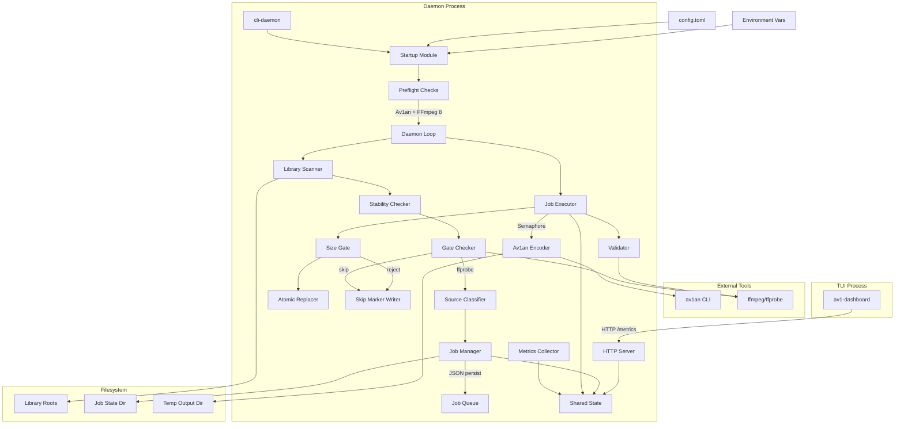
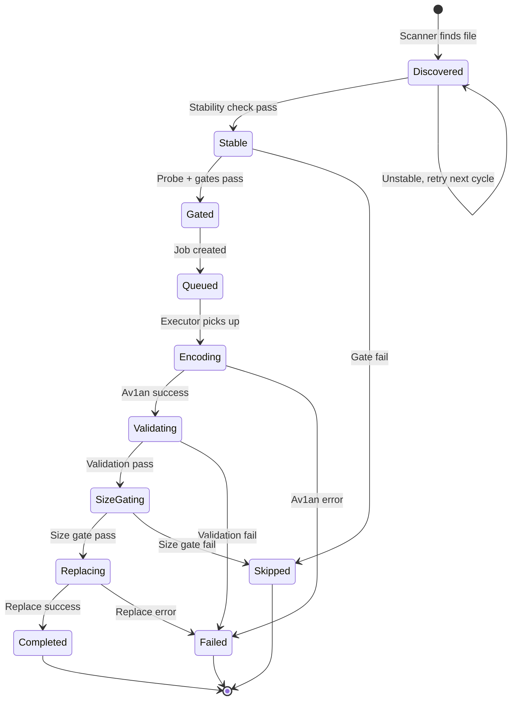

# Design Document

## Overview

The AV1 Super Daemon is a Rust-based media encoding automation system consisting of three main components:

1. **Daemon** (`cli-daemon` / `daemon` crates) - Background service that scans library directories, gates candidates, manages the encoding pipeline, persists job state as JSON, and handles atomic file replacement
2. **Av1an Integration** - Vendored from source as a workspace member, invoked via CLI with fixed film-grain-tuned settings
3. **TUI Dashboard** (`av1-dashboard` crate) - Terminal interface built with Ratatui for real-time monitoring

The system enforces software-only encoding using SVT-AV1 through Av1an, requires FFmpeg 8+, uses skip markers (`.av1skip`) to prevent reprocessing, validates output size against originals, and exposes metrics via HTTP for dashboard consumption.

## Architecture



## Components and Interfaces

### 1. Configuration Module (`crates/config`)

```rust
// Core configuration structures
pub struct Config {
    pub cpu: CpuConfig,
    pub av1an: Av1anConfig,
    pub encoder_safety: EncoderSafetyConfig,
    pub scan: ScanConfig,
    pub paths: PathsConfig,
    pub gates: GatesConfig,
}

pub struct CpuConfig {
    pub logical_cores: Option<u32>,
    pub target_cpu_utilization: f32,  // 0.5-1.0, default 0.85
}

pub struct Av1anConfig {
    pub workers_per_job: u32,      // 0 = auto-derive
    pub max_concurrent_jobs: u32,  // 0 = auto-derive
}

pub struct EncoderSafetyConfig {
    pub disallow_hardware_encoding: bool,  // default true
}

pub struct ScanConfig {
    pub library_roots: Vec<PathBuf>,       // directories to scan
    pub stability_wait_secs: u64,          // default 10
    pub write_why_sidecars: bool,          // default true
}

pub struct PathsConfig {
    pub job_state_dir: PathBuf,            // where job JSON files live
    pub temp_output_dir: PathBuf,          // temp encode output
}

pub struct GatesConfig {
    pub min_bytes: u64,                    // minimum file size
    pub max_size_ratio: f32,               // output/original ratio threshold (0,1]
    pub keep_original: bool,               // preserve backup after replacement
}

// Interface
pub trait ConfigLoader {
    fn load_from_file(path: &Path) -> Result<Config, ConfigError>;
    fn apply_env_overrides(&mut self);
}
```

### 2. Concurrency Module (`crates/daemon/src/concurrency.rs`)

```rust
pub struct ConcurrencyPlan {
    pub total_cores: u32,
    pub target_threads: u32,
    pub av1an_workers: u32,
    pub max_concurrent_jobs: u32,
}

// Interface
pub fn derive_plan(cfg: &Config) -> ConcurrencyPlan;
```

### 3. Startup Module (`crates/daemon/src/startup.rs`)

```rust
// Interface
pub fn assert_software_only(cfg: &Config) -> Result<(), StartupError>;
pub fn check_av1an_available() -> Result<(), StartupError>;
pub fn check_ffmpeg_version_8_or_newer() -> Result<(), StartupError>;
```

### 4. Av1an Encoder Module (`crates/daemon/src/encode/av1an.rs`)

```rust
pub struct Av1anEncodeParams {
    pub input_path: PathBuf,
    pub output_path: PathBuf,
    pub temp_chunks_dir: PathBuf,
    pub concurrency: ConcurrencyPlan,
}

// Interface
pub fn build_av1an_command(params: &Av1anEncodeParams) -> Command;
pub fn run_av1an(params: &Av1anEncodeParams) -> Result<(), EncodeError>;
```

### 5. Metrics Module (`crates/daemon/src/metrics.rs`)

```rust
pub struct JobMetrics {
    pub id: String,
    pub input_path: String,
    pub stage: String,
    pub progress: f32,
    pub fps: f32,
    pub bitrate_kbps: f32,
    pub crf: u8,
    pub encoder: String,
    pub workers: u32,
    pub est_remaining_secs: f32,
    pub frames_encoded: u64,
    pub total_frames: u64,
    pub size_in_bytes_before: u64,
    pub size_in_bytes_after: u64,
    pub vmaf: Option<f32>,
    pub psnr: Option<f32>,
    pub ssim: Option<f32>,
}

pub struct SystemMetrics {
    pub cpu_usage_percent: f32,
    pub mem_usage_percent: f32,
    pub load_avg_1: f32,
    pub load_avg_5: f32,
    pub load_avg_15: f32,
}

pub struct MetricsSnapshot {
    pub timestamp_unix_ms: i64,
    pub jobs: Vec<JobMetrics>,
    pub system: SystemMetrics,
    pub queue_len: usize,
    pub running_jobs: usize,
    pub completed_jobs: u64,
    pub failed_jobs: u64,
    pub total_bytes_encoded: u64,
}

// Shared state type
pub type SharedMetrics = Arc<RwLock<MetricsSnapshot>>;
```

### 6. Metrics HTTP Server (`crates/daemon/src/metrics_server.rs`)

```rust
// Interface
pub async fn run_metrics_server(state: SharedMetrics) -> Result<(), ServerError>;
// Exposes GET /metrics returning JSON MetricsSnapshot
```

### 7. Job Executor (`crates/daemon/src/daemon_loop.rs`)

```rust
pub struct JobExecutor {
    permits: Semaphore,
    concurrency_plan: ConcurrencyPlan,
    metrics: SharedMetrics,
}

// Interface
impl JobExecutor {
    pub fn new(plan: ConcurrencyPlan, metrics: SharedMetrics) -> Self;
    pub async fn execute(&self, job: Job) -> Result<(), JobError>;
}
```

### 8. TUI Dashboard (`crates/tui`)

```rust
// Main components
pub struct App {
    metrics: Option<MetricsSnapshot>,
    event_log: Vec<String>,
}

// Interface
impl App {
    pub fn new() -> Self;
    pub async fn fetch_metrics(&mut self) -> Result<(), FetchError>;
    pub fn render(&self, frame: &mut Frame);
}
```

### 9. Scanner Module (`crates/daemon/src/scan.rs`)

```rust
pub struct ScanCandidate {
    pub path: PathBuf,
    pub size_bytes: u64,
    pub modified_time: SystemTime,
}

// Interface
pub fn scan_libraries(roots: &[PathBuf]) -> Vec<ScanCandidate>;
pub fn has_skip_marker(path: &Path) -> bool;
pub fn skip_marker_path(video_path: &Path) -> PathBuf;

// Constants
pub const VIDEO_EXTENSIONS: &[&str] = &[".mkv", ".mp4", ".avi", ".mov", ".m4v", ".ts", ".m2ts"];
```

### 10. Stability Module (`crates/daemon/src/stable.rs`)

```rust
pub enum StabilityResult {
    Stable,
    Unstable { initial_size: u64, current_size: u64 },
}

// Interface
pub async fn check_stability(
    path: &Path,
    initial_size: u64,
    wait_secs: u64,
) -> Result<StabilityResult, io::Error>;
```

### 11. Gates Module (`crates/daemon/src/gates.rs`)

```rust
pub struct ProbeResult {
    pub video_streams: Vec<VideoStream>,
    pub audio_streams: Vec<AudioStream>,
    pub format: FormatInfo,
}

pub struct VideoStream {
    pub codec_name: String,
    pub width: u32,
    pub height: u32,
    pub bitrate_kbps: Option<f32>,
}

pub enum GateResult {
    Pass(ProbeResult),
    Skip { reason: String },
}

// Interface
pub fn probe_file(path: &Path) -> Result<ProbeResult, ProbeError>;
pub fn check_gates(probe: &ProbeResult, file_size: u64, cfg: &GatesConfig) -> GateResult;
```

### 12. Classifier Module (`crates/daemon/src/classify.rs`)

```rust
#[derive(Debug, Clone, Copy, PartialEq)]
pub enum SourceType {
    WebLike,
    DiscLike,
    Unknown,
}

// Interface
pub fn classify_source(path: &Path, probe: &ProbeResult) -> SourceType;
```

### 13. Job Manager Module (`crates/daemon/src/jobs.rs`)

```rust
pub struct Job {
    pub id: String,
    pub input_path: PathBuf,
    pub output_path: PathBuf,
    pub stage: JobStage,
    pub status: JobStatus,
    pub source_type: SourceType,
    pub probe_result: ProbeResult,
    pub created_at: i64,
    pub updated_at: i64,
    pub error_reason: Option<String>,
}

#[derive(Debug, Clone, Copy)]
pub enum JobStage {
    Queued,
    Encoding,
    Validating,
    SizeGating,
    Replacing,
    Complete,
}

#[derive(Debug, Clone, Copy)]
pub enum JobStatus {
    Pending,
    Running,
    Success,
    Failed,
    Skipped,
}

// Interface
pub fn create_job(candidate: &ScanCandidate, probe: ProbeResult, source_type: SourceType) -> Job;
pub fn save_job(job: &Job, state_dir: &Path) -> Result<(), io::Error>;
pub fn load_jobs(state_dir: &Path) -> Result<Vec<Job>, io::Error>;
pub fn job_exists_for_path(jobs: &[Job], path: &Path) -> bool;
```

### 14. Size Gate Module (`crates/daemon/src/size_gate.rs`)

```rust
pub enum SizeGateResult {
    Accept,
    Reject { original_bytes: u64, output_bytes: u64, ratio: f32 },
}

// Interface
pub fn check_size_gate(original_bytes: u64, output_bytes: u64, max_ratio: f32) -> SizeGateResult;
```

### 15. Replacer Module (`crates/daemon/src/replace.rs`)

```rust
// Interface
pub fn atomic_replace(
    original_path: &Path,
    encoded_path: &Path,
    keep_original: bool,
) -> Result<(), ReplaceError>;

pub fn backup_path(original: &Path) -> PathBuf;  // <name>.orig.<timestamp>
```

### 16. Skip Marker Module (`crates/daemon/src/skip_marker.rs`)

```rust
// Interface
pub fn write_skip_marker(video_path: &Path) -> Result<(), io::Error>;
pub fn write_why_sidecar(video_path: &Path, reason: &str) -> Result<(), io::Error>;
```

## Data Models

### Configuration File (`config.toml`)

```toml
[cpu]
logical_cores = 32          # Optional, auto-detect if omitted
target_cpu_utilization = 0.85

[av1an]
workers_per_job = 0         # 0 = auto-derive (8 for 32+ cores)
max_concurrent_jobs = 0     # 0 = auto-derive (1 for 24+ cores)

[encoder_safety]
disallow_hardware_encoding = true

[scan]
library_roots = ["/media/movies", "/media/tv"]
stability_wait_secs = 10
write_why_sidecars = true

[paths]
job_state_dir = "/var/lib/av1-daemon/jobs"
temp_output_dir = "/var/lib/av1-daemon/temp"

[gates]
min_bytes = 1048576         # 1 MB minimum
max_size_ratio = 0.95       # reject if output >= 95% of original
keep_original = false       # delete backup after successful replacement
```

### Job State Machine



### Job JSON Schema

```json
{
  "id": "job-abc123",
  "input_path": "/media/movies/film.mkv",
  "output_path": "/var/lib/av1-daemon/temp/job-abc123.mkv",
  "stage": "encoding",
  "status": "running",
  "source_type": "disc_like",
  "probe_result": {
    "video_streams": [{"codec_name": "hevc", "width": 1920, "height": 1080, "bitrate_kbps": 25000}],
    "audio_streams": [{"codec_name": "truehd", "channels": 8}],
    "format": {"duration_secs": 7200, "size_bytes": 22548578304}
  },
  "created_at": 1701388800000,
  "updated_at": 1701392400000,
  "error_reason": null
}

### Metrics Snapshot (JSON)

```json
{
  "timestamp_unix_ms": 1701388800000,
  "jobs": [
    {
      "id": "job-001",
      "input_path": "/media/video.mkv",
      "stage": "encoding",
      "progress": 0.45,
      "fps": 12.5,
      "bitrate_kbps": 8500.0,
      "crf": 8,
      "encoder": "svt-av1",
      "workers": 8,
      "est_remaining_secs": 3600.0,
      "frames_encoded": 54000,
      "total_frames": 120000,
      "size_in_bytes_before": 5368709120,
      "size_in_bytes_after": 2147483648,
      "vmaf": null,
      "psnr": null,
      "ssim": null
    }
  ],
  "system": {
    "cpu_usage_percent": 85.2,
    "mem_usage_percent": 42.1,
    "load_avg_1": 27.5,
    "load_avg_5": 26.8,
    "load_avg_15": 25.2
  },
  "queue_len": 5,
  "running_jobs": 1,
  "completed_jobs": 42,
  "failed_jobs": 2,
  "total_bytes_encoded": 107374182400
}
```


## Correctness Properties

*A property is a characteristic or behavior that should hold true across all valid executions of a system-essentially, a formal statement about what the system should do. Properties serve as the bridge between human-readable specifications and machine-verifiable correctness guarantees.*

### Property 1: Concurrency Plan Derivation

*For any* CPU configuration with `logical_cores` and no explicit worker/job settings, the derived concurrency plan SHALL:
- Set `av1an_workers = 8` when cores >= 32, otherwise `av1an_workers = 4`
- Set `max_concurrent_jobs = 1` when cores >= 24, otherwise `max_concurrent_jobs = 2`

**Validates: Requirements 1.1, 1.2, 1.3**

### Property 2: Explicit Configuration Override

*For any* configuration with explicit non-zero `workers_per_job` or `max_concurrent_jobs` values, the derived concurrency plan SHALL use those explicit values unchanged.

**Validates: Requirements 1.4**

### Property 3: Utilization Clamping

*For any* `target_cpu_utilization` value, the effective utilization used in concurrency planning SHALL be clamped to the range [0.5, 1.0].

**Validates: Requirements 1.5**

### Property 4: Av1an Command Completeness

*For any* valid `Av1anEncodeParams` (input path, output path, temp dir, concurrency plan), the built command SHALL contain all required arguments:
- `-i <input_path>` and `-o <output_path>`
- `--encoder svt-av1`
- `--pix-format yuv420p10le`
- `--crf 8`
- `--preset 3`
- `--svt-params tune=grain:film-grain=20:enable-qm=1:qm-min=1:qm-max=15:keyint=240:lookahead=40`
- `--target-quality 1`
- `--audio-copy`
- `--workers <concurrency.av1an_workers>`
- `--temp <temp_chunks_dir>`

**Validates: Requirements 2.1, 2.2, 2.3, 2.4, 2.5, 2.6, 2.7, 10.1, 10.2, 10.3, 10.4, 10.5, 10.6, 10.7, 10.8, 10.9, 10.10, 10.11**

### Property 5: Hardware Flag Detection

*For any* string containing one of the forbidden substrings (`nvenc`, `qsv`, `vaapi`, `cuda`, `amf`, `vce`, `qsvenc`), the software-only assertion SHALL reject it when `disallow_hardware_encoding` is enabled.

**Validates: Requirements 3.1, 3.2**

### Property 6: FFmpeg Version Parsing

*For any* FFmpeg version string (including `n`-prefixed formats like `n8.0-...`), the version parser SHALL correctly extract the major version number and accept versions >= 8.

**Validates: Requirements 4.5**

### Property 7: MetricsSnapshot Serialization Round-Trip

*For any* valid `MetricsSnapshot`, serializing to JSON and deserializing back SHALL produce an equivalent snapshot with all fields preserved (jobs, system metrics, aggregate counts).

**Validates: Requirements 7.2, 7.3, 7.4, 7.5**

### Property 8: Configuration Parsing and Environment Override

*For any* valid TOML configuration string and set of environment variable overrides, the loaded configuration SHALL:
- Parse all sections (cpu, av1an, encoder_safety)
- Apply environment variable overrides for `CPU_LOGICAL_CORES`, `CPU_TARGET_UTILIZATION`, `AV1AN_WORKERS_PER_JOB`, `AV1AN_MAX_CONCURRENT_JOBS`, `ENCODER_DISALLOW_HARDWARE_ENCODING`

**Validates: Requirements 8.1, 8.2, 8.3, 8.4, 8.5, 8.6**

### Property 9: Scanner Video Extension Filtering

*For any* file path, the scanner SHALL include it as a candidate if and only if its extension (case-insensitive) is one of: `.mkv`, `.mp4`, `.avi`, `.mov`, `.m4v`, `.ts`, `.m2ts`.

**Validates: Requirements 11.3**

### Property 10: Scanner Hidden Directory Exclusion

*For any* directory tree, the scanner SHALL never return files that are descendants of directories whose names start with `.` (hidden directories).

**Validates: Requirements 11.2**

### Property 11: Scanner Skip Marker Exclusion

*For any* video file path, if a corresponding `.av1skip` marker file exists (same directory, `<filename>.av1skip`), the scanner SHALL exclude that file from candidates.

**Validates: Requirements 11.4, 18.3, 18.4**

### Property 12: Stability Check Size Comparison

*For any* initial file size and current file size, the stability checker SHALL return `Stable` if and only if `initial_size == current_size`.

**Validates: Requirements 12.2, 12.3, 12.4**

### Property 13: Gate Rejection for No Video Streams

*For any* probe result with zero video streams, the gate checker SHALL return `Skip` with reason containing "no video streams".

**Validates: Requirements 13.3**

### Property 14: Gate Rejection for Minimum Size

*For any* file size below the configured `min_bytes` threshold, the gate checker SHALL return `Skip` with reason containing "below minimum size".

**Validates: Requirements 13.4**

### Property 15: Gate Rejection for Already AV1

*For any* probe result where the first video stream has codec name containing "av1" (case-insensitive), the gate checker SHALL return `Skip` with reason containing "already AV1".

**Validates: Requirements 13.5**

### Property 16: Gate Pass for Valid Files

*For any* probe result with at least one non-AV1 video stream, file size >= `min_bytes`, the gate checker SHALL return `Pass`.

**Validates: Requirements 13.6**

### Property 17: Job JSON Serialization Round-Trip

*For any* valid `Job` struct, serializing to JSON and deserializing back SHALL produce an equivalent job with all fields preserved (id, paths, stage, status, source_type, probe_result, timestamps, error_reason).

**Validates: Requirements 14.1, 14.2, 14.4**

### Property 18: Source Classification Consistency

*For any* path and probe result, the classifier SHALL return exactly one of `WebLike`, `DiscLike`, or `Unknown` - never multiple or none.

**Validates: Requirements 15.1, 15.4**

### Property 19: Size Gate Threshold

*For any* original size, output size, and max_ratio, the size gate SHALL return `Reject` if and only if `output_size >= original_size * max_ratio`.

**Validates: Requirements 16.1, 16.2, 16.4**

### Property 20: Skip Marker Path Construction

*For any* video file path `/dir/file.ext`, the skip marker path SHALL be `/dir/file.ext.av1skip`.

**Validates: Requirements 18.4**

## Error Handling

### Startup Errors

| Error Condition | Handling |
|-----------------|----------|
| Av1an not found | Abort with message: "av1an --version failed; is Av1an built and in PATH?" |
| FFmpeg < 8.0 | Abort with message: "FFmpeg 8.x required, got: {version}" |
| Hardware flags detected | Abort with message: "Hardware encoding flag '{flag}' found in '{arg}', but hardware encoding is disabled" |
| Config parse failure | Abort with message indicating TOML parse error |
| Empty library_roots | Abort with message: "No library roots configured" |
| Invalid max_size_ratio | Abort with message: "max_size_ratio must be in (0, 1]" |

### Runtime Errors

| Error Condition | Handling |
|-----------------|----------|
| Av1an process fails | Mark job as `Failed`, log error, continue with next job |
| Validation fails | Mark job as `Failed`, preserve original file, log reason |
| File replacement fails | Mark job as `Failed`, log error, preserve original and temp files |
| Metrics fetch fails (TUI) | Display stale data with "Connection lost" indicator |
| Probe fails | Create `.av1skip` marker, optionally `.why.txt`, skip file |
| Size gate fails | Mark job `Skipped`, create skip markers, delete temp output |
| Stability check fails | Retry on next scan cycle |
| Job state dir inaccessible | Log error, continue without persistence |

### Error Types

```rust
#[derive(Debug, thiserror::Error)]
pub enum StartupError {
    #[error("Av1an not available: {0}")]
    Av1anUnavailable(String),
    
    #[error("FFmpeg version requirement not met: {0}")]
    FfmpegVersion(String),
    
    #[error("Hardware encoding detected: {0}")]
    HardwareEncodingDetected(String),
    
    #[error("Configuration error: {0}")]
    Config(#[from] ConfigError),
}

#[derive(Debug, thiserror::Error)]
pub enum EncodeError {
    #[error("Av1an failed with status: {0}")]
    Av1anFailed(i32),
    
    #[error("IO error: {0}")]
    Io(#[from] std::io::Error),
}

#[derive(Debug, thiserror::Error)]
pub enum JobError {
    #[error("Encode failed: {0}")]
    Encode(#[from] EncodeError),
    
    #[error("Validation failed: {0}")]
    Validation(String),
    
    #[error("Replacement failed: {0}")]
    Replacement(#[from] std::io::Error),
    
    #[error("Size gate rejected: output {output_bytes} >= original {original_bytes} * {ratio}")]
    SizeGateRejected { original_bytes: u64, output_bytes: u64, ratio: f32 },
}

#[derive(Debug, thiserror::Error)]
pub enum ProbeError {
    #[error("ffprobe failed: {0}")]
    FfprobeFailed(String),
    
    #[error("Failed to parse ffprobe output: {0}")]
    ParseError(String),
}

#[derive(Debug, thiserror::Error)]
pub enum ReplaceError {
    #[error("Failed to create backup: {0}")]
    BackupFailed(std::io::Error),
    
    #[error("Failed to copy encoded file: {0}")]
    CopyFailed(std::io::Error),
    
    #[error("Failed to delete backup: {0}")]
    DeleteBackupFailed(std::io::Error),
}
```

## Testing Strategy

### Property-Based Testing Framework

This project will use **proptest** for property-based testing in Rust. Each property test will run a minimum of 100 iterations.

### Property-Based Tests

Each correctness property will be implemented as a property-based test:

1. **Concurrency derivation** - Generate random core counts, verify worker/job derivation rules
2. **Explicit config override** - Generate random explicit values, verify they're preserved
3. **Utilization clamping** - Generate random floats, verify clamping to [0.5, 1.0]
4. **Command completeness** - Generate random paths/plans, verify all flags present
5. **Hardware flag detection** - Generate strings with forbidden substrings, verify rejection
6. **FFmpeg version parsing** - Generate version strings in various formats, verify parsing
7. **MetricsSnapshot round-trip** - Generate random snapshots, verify JSON serialization round-trip
8. **Config parsing/override** - Generate TOML configs and env vars, verify loading and override
9. **Video extension filtering** - Generate random file paths, verify only video extensions pass
10. **Hidden directory exclusion** - Generate directory trees with hidden dirs, verify exclusion
11. **Skip marker exclusion** - Generate paths with/without markers, verify exclusion logic
12. **Stability size comparison** - Generate size pairs, verify stable/unstable determination
13. **Gate no video streams** - Generate probe results with 0 video streams, verify rejection
14. **Gate minimum size** - Generate file sizes and thresholds, verify rejection logic
15. **Gate already AV1** - Generate probe results with AV1 codec, verify rejection
16. **Gate pass valid** - Generate valid probe results, verify acceptance
17. **Job JSON round-trip** - Generate random jobs, verify serialization round-trip
18. **Classification consistency** - Generate paths/probes, verify exactly one classification
19. **Size gate threshold** - Generate size pairs and ratios, verify accept/reject logic
20. **Skip marker path** - Generate video paths, verify marker path construction

### Unit Tests

- Startup checks with mocked external commands
- Job state machine transitions
- Metrics aggregation logic
- TUI widget rendering
- Probe result parsing
- Source classification heuristics

### Integration Tests

- End-to-end encoding of small test files
- Metrics server request/response cycle
- TUI connection to daemon
- Job persistence and recovery
- Skip marker creation and detection

### Test Annotations

All property-based tests will be annotated with:
```rust
// **Feature: av1-super-daemon, Property {N}: {property_text}**
// **Validates: Requirements X.Y**
```
